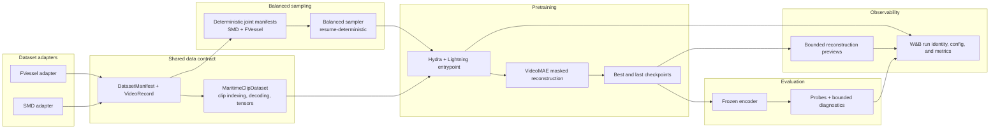

# Foundation architecture

The v1 stack keeps dataset-specific discovery separate from the shared
[DatasetManifest](../src/marineworld/data/contracts.py#L36) and
[VideoRecord](../src/marineworld/data/contracts.py#L15) contract. The
[MaritimeClipDataset](../src/marineworld/data/clips.py#L122) consumes that
contract. Balanced SMD/FVessel sampling is an input to pretraining; evaluation
loads the resulting encoder from a checkpoint, and observability receives only
bounded experiment outputs.

## Pull request map

| Pull request | Architectural contribution |
| --- | --- |
| [PR #3 — VideoMAE pretraining](https://github.com/charleneleong-ai/marineworld-fm/pull/3) | VideoMAE model and Lightning pretraining entrypoint, with core W&B run identity and metrics. |
| [PR #4 — Representation evaluation](https://github.com/charleneleong-ai/marineworld-fm/pull/4) | Frozen encoder loading, lightweight probes, and bounded evaluation diagnostics. |
| [PR #5 — Joint maritime pretraining](https://github.com/charleneleong-ai/marineworld-fm/pull/5) | Deterministic joint manifests plus balanced SMD/FVessel sampling and resume behavior feeding pretraining. |
| [PR #6 — W&B media](https://github.com/charleneleong-ai/marineworld-fm/pull/6) | Validation and best-checkpoint reconstruction previews sent to W&B at bounded intervals. |
